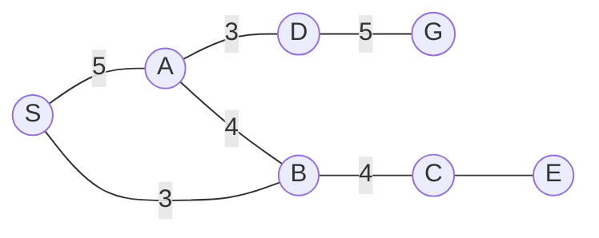
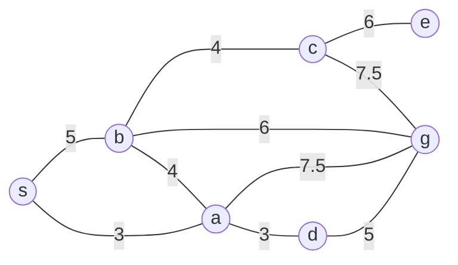
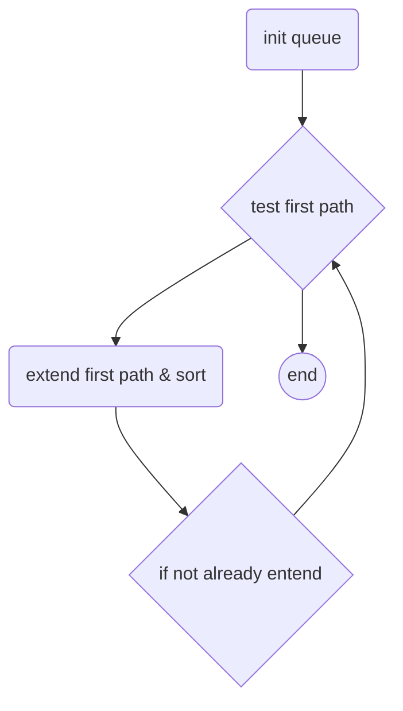

# 公开课：artificial intelligence

## 04.搜索 深度广度

搜索是关于选择的

示例：




#### 1.深度优先

原理：

1. 初始化一个队列，将起点放入队列
2. 然后<检查是否能到达终点>，是结束，否则进行下一步；
3. 扩展第一条路径将其放入**队列头部**，同时删除其上一步放入队列的节点
4. 回到步骤（2）

#### 2.广度优先

原理：深度优先将扩展节点放入队列**头部**， 广度优先只需要将扩展节点放入队列**尾部**即可，其他步骤不变

##### 缺陷

1. 会走很多重复的路径，在另一个节点中已经走过，但是还会再走一遍；
2. 如果从一个图的中间某点开始，那么当终点在右边时，无论深度还是广度都会搜索到左边（无用搜索），但是你用肉眼就绝对不会做这种事

##### 改进

1. 需要记录每次走到的最后一个节点，之后如果再走到之前走过的节点，就不再继续往下；

#### 3.hill climbing search(爬山搜索)

原理：

​	构造一个从终点到起点的权重累加的结果列表（**额外已知信息**）；然后从起点开始选择，使用结果列表可知下一步该选择哪一个点，总是选择离目标最近的那个点，这样到达目标的路径就是最近的

#### 4.beam search（束搜索）

原理：

​	设置一个预值W=2，就是束值；其余搜素和广度优先一致，然后每层搜索结果只保留预值个数（也就是2个），保留的条件是离终点最近

示例：起点S，终点G

第一层：s; 

第二层：a , b; 刚好为2 ，不删除

第三层：a->b, d;  b->a,c; 由于b->a,c 距离终点G远所以删除b->a,c

第四层：b->c; d->g; over


## 05.搜索：最优、分支限界、A*

简介：这一讲主要讨论了最短路径问题。首先教授在黑板上演示了一个例子，介绍分支限界法[0:00:00]。之后，教授引入了扩展列表，避免重复扩展，以优化分支限界法[0:18:35]。再后，教授通过可容许启发式对算法进行了优化，避免寻找最短路径时往反方向进行的无谓搜索[0:25:15]。最后，教授将上述两种优化加到分支限界法上，得到A*算法，并讲解了A\*算法中可能碰到的一些问题[0:36:00]

#### Algorithm list

- [ ] oracle （已知最优解）
- [ ] branch & bound （分支限界）
- [ ] +extended list （扩展列表）
- [ ] +admissible  heuristic (可容许启发式)
- [ ] A*（branch & bound + extended list + admissible  heuristic）

#### best path

示例：s -> g



**总是扩展最短的路径**



#### conceptions

Admissible(可容许性): $H(x,G) <= D(x,G)$

Consistence（一致性）: $|H(x,G) - H(y, G)| <= D(x, Y)$


### 06.搜索：博弈、极小化极大、α~β

### 07.约束：解释线条图

concave：

```mermaid
graph LR
a1（ ） --> b1（ ）
```

